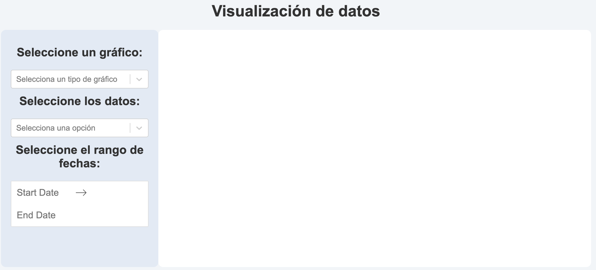
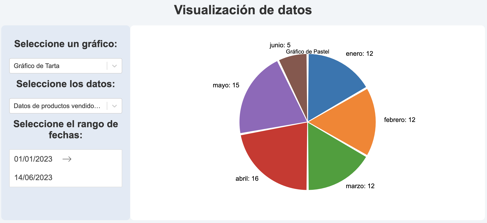

# Visualización de Datos React

`Creador:`William David Camacho Sanchez
`Correo:`widacasan@gmail.com

Este proyecto es una aplicación web desarrollada en React que permite visualizar datos de manera interactiva a través de diferentes tipos de gráficos. Proporciona a los usuarios la capacidad de seleccionar conjuntos de datos, tipos de gráficos y rangos de fechas para explorar y analizar la información de manera efectiva.

## Características principales

- `Selección de gráficos:` Permite a los usuarios elegir entre una variedad de tipos de gráficos para visualizar los datos de manera efectiva.

- `Selección de datos:` Proporciona conjuntos de datos predefinidos y la capacidad de cargar conjuntos de datos personalizados para una visualización personalizada.

- `Filtrado por rango de fechas:` Permite a los usuarios establecer un rango de fechas específico para analizar tendencias y patrones temporales.

- `Interactividad y personalización:` Ofrece una experiencia interactiva y la posibilidad de personalizar colores, etiquetas y estilos de los gráficos.

- `Facilidad de uso:` Interfaz intuitiva y amigable que facilita la selección y configuración de gráficos, datos y rangos de fechas.

## Tecnologias utilizadas

- `React:` Un framework de JavaScript utilizado para construir interfaces de usuario interactivas y reutilizables.

- `JavaScript:` El lenguaje de programación principal utilizado en el proyecto para la lógica y funcionalidad del lado del cliente.

- `HTML:` Se utiliza para estructurar y presentar el contenido web.

- `CSS:` Se utiliza para aplicar estilos y diseños al proyecto.

- `Chart.js:` Una biblioteca de gráficos de código abierto que proporciona una amplia gama de gráficos interactivos y personalizables.

- `React Datepicker:` Una biblioteca de componentes de selección de fechas para React, utilizada para el componente de selección de rango de fechas en el proyecto.

## Capturas de Pantalla



## Instalación y uso

1. Clona este repositorio en tu máquina local.
2.  Ve al directorio del proyecto:
``` bash
$cd data-visualization-app
```
3. Ejecuta el siguiente comando para instalar las dependencias: 
```bash
$ npm install --legacy-peer-deps
```

4. Ejecuta el siguiente comando para iniciar la aplicación: 
```bash
$ npm start
```

5. Abre tu navegador y accede a http://localhost:3000 para ver la aplicación en funcionamiento.


## Estructura del Proyecto

El proyecto sigue la siguiente estructura de directorios:

```
├── public
│   ├── index.html
│   └── ...
├── src
│   ├── components
│   │   ├── Chart.js
│   │   ├── ChartSelector.js
│   │   ├── DataSelector.js
│   │   ├── DateRangeFilter.js
│   ├── data
│   │   └── data.json
│   ├── styles.css
│   └── App.js
├── screenshhots
|   ├── Grafica1.png
│   ├── Grafica2.png
├── package.json
└── README.md
```

El proyecto está estructurado de la siguiente manera:

- `public/:` Contiene los archivos HTML estáticos y otros recursos públicos.
- `src/:` Contiene los archivos fuente de la aplicación.
- components/: Contiene los componentes de React utilizados en la aplicación.
- `data/:` Contiene los archivos de datos utilizados en la visualización.
- `styles.css:` Archivo CSS con los estilos de la aplicación.
- `App.js:` Componente principal de la aplicación.
- `index.js:` Punto de entrada de la aplicación.